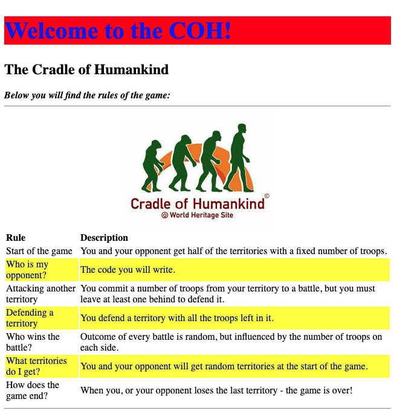

# Lab: CSS Syntax

* Open Google Chrome browser to [https://repl.it](https://repl.it/)
* Open the repl you have created in the previous labs
* Select `index.html` in the `Files` pane to edit it
* Locate the table element and remove the border attribute with its value
* Locate the div element and remove the `align` attribute with its values 
* Between the opening and closing tags for head element, insert a reference to the stylesheet file by coping the line below:
* ```text
  <link rel="stylesheet" type="text/css" href="style.css"/>
  ```
* This will allow a web browser to use the styles defined in the `style.css` file and decorate `index.html` content
* Select `style.css` in the `Files` pane to edit
* Add a style to format `h1` element with your desired colour and a font-size or font-family, e.g.:
* ```text
  h1 {
      color: blue; 
      font-size: 40px;
      font-family: 'Times New Roman';
      background-color: red;
  }
  ```
* `run` the changes every time you make a modification to CSS/Html files
* Select index.html in the `Files` pane to edit
* Add an id attribute to the existing Html element with `h2` tag, e.g.:
* ```text
  <h2 id="subTitle">...</h2>
  ```
* Select `style.css` in the `Files` pane to edit
* Use the [CSS id Selector ](https://www.w3schools.com/css/css_selectors.asp)syntax to create a style for the text: `The Cradle of Humankind`
* Now we want to highlight every other row in the rules table
* Create a new class in `style.css` to highlight for a table row:

```text
.highlightedRow {
  color: darkblue;
  background-color: yellow
}
```

* Edit index.html to add the reference to the above-created class using [CSS Class Selector](https://www.w3schools.com/cssref/sel_class.asp) syntax for every second opening of `<tr>` tag, e.g.: `<tr class="highlightedRow">`, pay attention to the case-sensitive spelling!
* Now, figure out how to position the image horizontally-centred using an online reference without detailed instructions: [https://www.w3schools.com/howto/howto\_css\_image\_center.asp](https://www.w3schools.com/howto/howto_css_image_center.asp)



