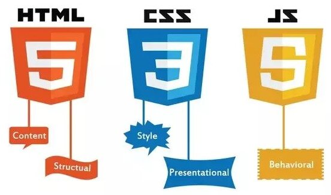

# Html, CSS and JavaScript

* HTML provides the basic structure of a website
* CSS is used to control presentation, formatting, and layout
* JavaScript is used to control the behavior of different elements