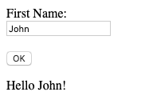

# Lab: User Interactions

1. Navigate to [https://repl.it](https://repl.it) and login if required
2. Create a new repl and select Html, Css, JS template, name it `lab-user-interactions`
3. On the right you will be selecting files to edit
4. In the middle pane, you will be writing Html/Javascript code
5. The `run` button on the top will render the Html and run Javascript
6. In the right pane you will see the result and you can also open the result in a new browser tab/window
7. In the `index.html` page, create a new input element for first name
8. The input element should have a label in front of it, e.g.: 'First Name:' and should use type [text](https://developer.mozilla.org/en-US/docs/Web/HTML/Element/input/text) and have id attribute equal `firstName`, e.g.:
```html
<input type="text" id="firstName"/>
```
9. Under the input field place another input and use [button](https://www.w3schools.com/tags/tag_button.asp) type and text `Ok`
10. Under the button add a `div` element with id attribute `messageElm`
11. In the `script.js` file create a new function with any name e.g.: `OkClick`
12. The function code should find html element by id using the [getElementById](https://www.w3schools.com/jsref/met_document_getelementbyid.asp) syntax
13. Read `value` attribute of the element found and assign the value to a variable
14. The next step will be to display the message `Hello ${firstName}` where first name will be replaced by the value of input element, e.g.
  ```javascript
  const message = `Hello ${firstName}!`;
  ```
15. Now we need to find the division where to place the message:
```javascript
const messagePlaceholder = document.getElementById("messageElm");
```
16. And replace the element text with the message:
```javascript
messagePlaceholder.innerText = message;
```
17. Open the preview in a new browser Tab/Window to see your changes, enter your name in the input element, click on the button and you should see the result:



18. You may also see errors in the [Javascript console](https://www.webucator.com/how-to/how-open-google-chromes-javascript-console.cfm) should be there errors in your code
19. Additionally, you can view the html behind every element on the page by using [Inspect](https://www.geeksforgeeks.org/chrome-inspect-element-tool-shortcut/) menu
20. You will be spending as much time debugging your Javascript code as writing it, the same goes for Html and Css, get used to the fact nothing works as expected the first 10 times