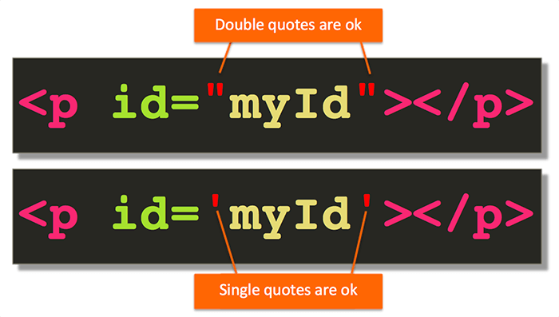

# Attribute Quotes

* Attribute values are enclosed in double or single quotes, we will use double quotes for consistency
* Attributes, similarly to elements, are well known and are getting added and removed over time
* An anchor attribute is used to link a text or an image to another page/website
* Example of a link: &lt;a href="\[[https://www.google.ca"&gt;A\]\(https://www.google.ca"&gt;A](https://www.google.ca">A]%28https://www.google.ca">A)\) link to Google website&lt;/a&gt;

