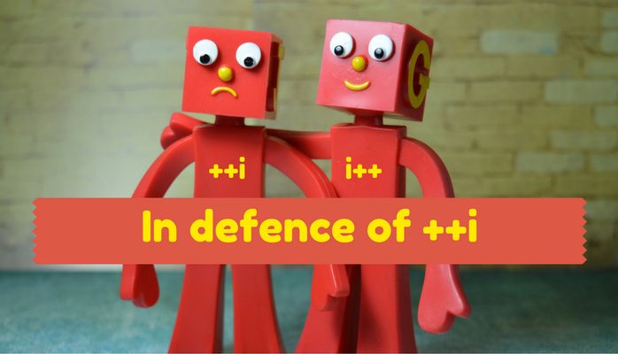

# Increment & Decrement

| Operator | Description | Example |
| - | - | - |
| ++a | Pre-increment: increments `a` by 1, then returns the result | `let a = 1; const b = ++a;` |
| a-- | Post-increment: returns the value and then increments by 1 | `let a = 1; const b = a++;` |
| --a | Pre-decrement: decrements `a` by 1, then returns the result | `let a = 1; const b = --a;` |
| a-- | Post-decrement: returns the value and then decrement by 1 | `let a = 1; const b = a--;` |
