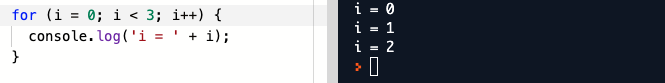

# Loops



* Loops are used to execute the same statements repeatedly
* The idea behind a loop is to automate repetitive tasks within a program
* The benefit of the loop is to save the time and effort without duplication of code
* The `for` loop repeats a block of code as long as a certain condition is met
* The syntax of the `for` loop:
```
for(initialization; condition; increment) {
    // Statement(s) to be executed
}
```
* Initialization creates a variable with an initial value
* Condition defines whether the loop should continue or stop
* Increment is using an operator to modify the value of the variable initialized
* Example of a `for` loop:
```
for(i = 1; i < 5; i++) {
  console.log('i = ' + i);
}
```
* Create a variable `i` with a value `1`, continue before the value reaches `5`, increment by `1` every time
* Print the value of `i` inside the loop, `i` is for index or for iterator