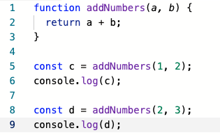

# Functions

* A function is a group of statements for a specific task, e.g. adding two numbers
* Provide a way to create reusable code packages
* Makes easier to eliminate errors and to modify  code
* `addNumbers` is a name of the function
* `a, b` are parameters or arguments passed when calling the function
* Function statements surrounded by `{` and `}` 
* Calling the function: `const c = addNumbers(1, 2);`
* We write functions once and reuse it twice from the example above

