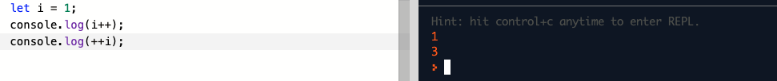

# Increment & Decrement

| Operator | Description | Example |
| :--- | :--- | :--- |
| a++ | Increment: adds 1 to the value | `let a = 1; a++; // a is now equal 2` |
| a-- | Decrement: subtracts 1 from the value | `let a = 1; a--; // a is now equal 0` |

