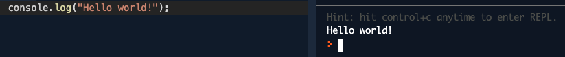

# Introduction

* JavaScript or JS is a programming language that can add dynamic interactivity to websites
* First released in [1995](https://medium.com/@benastontweet/lesson-1a-the-history-of-javascript-8c1ce3bffb17) to enhance the websites with the ability to change dynamically as a user interacts with a page
* The language is incredibly versatile and well suited for beginners
* Today you can use JavaScript for two-dimension or [2D](https://codepen.io/jackrugile/pen/fxqKJ) flat and [3D](https://codepen.io/yuanchuan/full/ZqbVVL) life-like animation and even games
* JavaScript is used for front-end, back-end and database development
* It is one of the most [popular languages](https://octoverse.github.com/#top-languages) with the exact position varies depending on the source and is [usually high](https://www.tiobe.com/tiobe-index/)

